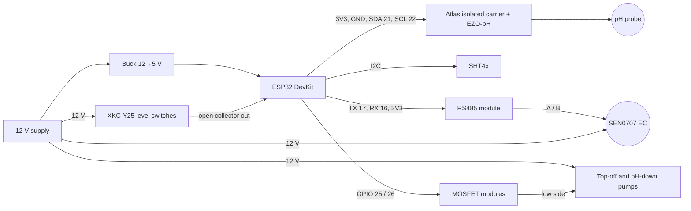

# DWC node (`dwc-1`)

One ESP32 serving the two side-by-side 5 gal DWC buckets. **Phase 1 builds Reservoir A
only.** Reservoir B uses the same parts and the reserved pins below.

Firmware: [`esphome/dwc-1.yaml`](../../esphome/dwc-1.yaml)

## Parts (phase 1)

Prices are approximate (2026). The Atlas and DFRobot prices were checked against the
manufacturers' sites; the rest are typical street prices.

| Qty | Part | Notes | ≈ USD |
|---|---|---|---|
| 1 | ESP32-DevKitC (ESP32-WROOM-32) | Any `esp32dev`-compatible board | 10 |
| 1 | Atlas Scientific pH kit | EZO-pH, lab-grade probe, Electrically Isolated EZO Carrier, calibration solutions | 175 |
| 1 | DFRobot SEN0707 RS485 EC sensor, K=10 | 10-20000 µS/cm, built-in temperature | 159 |
| 1 | 3.3 V RS485 transceiver module, automatic direction | MAX3485/SP3485-based. Avoid 5 V-only MAX485 boards. | 5 |
| 1 | SHT40 or SHT45 breakout (I2C) | Air temperature and humidity | 8 |
| 3 | XKC-Y25-NPN non-contact level switch | 2 on the bucket, 1 on the top-off tank | 25 |
| 1 | 12 V peristaltic dosing pump | pH-down | 15 |
| 1 | 12 V self-priming diaphragm pump, about 1-2 L/min | Top-off | 15 |
| 2 | Logic-level MOSFET switch module, 3.3 V input | AOD4184 or IRLR7843 boards. Avoid IRF520 boards, which don't turn fully on at 3.3 V. | 6 |
| 2 | Flyback diode (1N5819 or 1N4007) | Across each pump, if the MOSFET board lacks one | 1 |
| 1 | 12 V 3 A power supply | Powers pumps, EC sensor and level switches | 12 |
| 1 | 12 V → 5 V buck converter | Powers the ESP32 | 3 |
| 1 | Floor leak probe | Two-contact pad, or two stainless screws in a plastic block | 3 |
| 1 | Power-monitoring smart plug | For the air pump; Home Assistant alerts on low power | 20 |
| 1 | Top-off tank | Lidded 5 gal bucket or tote | 10 |
| | Enclosure, cable glands, terminal blocks, perfboard, silicone tubing | | 30 |
| | pH-down, EC standard solution (1413 µS/cm), handheld pH and EC pens for cross-checks | | 50 |

Phase 1 total: about $550. Reservoir B adds about $400 (pH kit, EC sensor, 2 level
switches, 2 pumps, 2 MOSFET modules).

## Pin map

| Function | GPIO | Notes |
|---|---|---|
| I2C SDA | 21 | EZO carriers, SHT4x |
| I2C SCL | 22 | |
| RS485 TX | 17 | To the module's TX/DI input. If no readings, swap TX and RX. |
| RS485 RX | 16 | |
| Top-off tank low switch | 18 | Internal pull-up |
| Floor leak probe | 19 | Internal pull-up, probe shorts to GND |
| **Reservoir A** low level switch | 32 | Internal pull-up |
| **Reservoir A** high level switch | 33 | Internal pull-up |
| **Reservoir A** top-off pump | 25 | MOSFET gate |
| **Reservoir A** pH-down pump | 26 | MOSFET gate |
| Reservoir B low level switch | 27 | Reserved |
| Reservoir B high level switch | 14 | Reserved |
| Reservoir B top-off pump | 13 | Reserved |
| Reservoir B pH-down pump | 4 | Reserved |
| Spare | 23 | Output-capable |
| Spare inputs | 34, 35, 36, 39 | Input only, no internal pull-ups (good for flow sensors with external pull-ups) |

Avoid the ESP32 strapping pins 0, 2, 5, 12 and 15 for anything that must stay quiet at boot.

## I2C and Modbus addresses

| Device | Bus | Address |
|---|---|---|
| Reservoir A EZO-pH | I2C | 99 (0x63, factory default) |
| Reservoir B EZO-pH | I2C | 49 (0x31) |
| SHT4x | I2C | 0x44 |
| Reservoir A EC sensor | RS485 | 1 (factory default) |
| Reservoir B EC sensor | RS485 | 2 |

How to change addresses: [calibration.md](../calibration.md).

## Wiring

- **Ground:** the 12 V supply, buck converter, ESP32, RS485 module, EC sensor, level
  switches and MOSFET modules share one ground. The pH probe stays isolated behind its
  carrier board.
- **EZO carrier:** powered at 3.3 V from the ESP32 so its I2C lines match the ESP32's
  logic level.
- **Level switches:** typical XKC-Y25-NPN wiring is brown +12 V, blue GND, yellow
  output, and on some versions a black mode wire that inverts the output. Check the
  label. The output is open-collector, pulled up by the ESP32 to 3.3 V. **Never add a
  pull-up to 12 V.** The firmware expects the output to go low when water is present;
  confirm on the bench (below).
- **Pumps:** pump + to 12 V, pump − to the MOSFET drain. Put a flyback diode across
  each pump (band toward +12 V) if the module doesn't have one. MOSFET modules
  should have a gate pull-down so pumps stay off while the ESP32 boots.
- **Enclosure:** mount it above the water line and give every cable entering it a
  drip loop. Details in [safety.md](../safety.md).

## Physical layout

- **Level switches:** the low switch sits where top-off should start (keep roots in
  reach of the water). The high switch sits where filling should stop, at least 2 cm
  below the net pot. The gap between them sets how much each fill adds.
- **Top-off line:** ends above the bucket's water surface (an air gap), never
  submerged. Put the top-off tank lower than the line's outlet so it can't siphon.
- **pH-down line:** also ends above the water, near the air stone so it mixes fast.
  Dilute pH-down about 1:10 with RO or distilled water for finer dosing.
- **EC probe:** fully submerged, away from the air stone's bubble column (bubbles on
  the electrodes read low).
- **pH probe:** submerged to the depth Atlas recommends, also clear of the bubbles.

## Bench test (before water)

1. Copy `esphome/secrets.yaml.example` to `esphome/secrets.yaml` and fill it in, then
   flash over USB: `esphome run esphome/dwc-1.yaml`.
2. In the log, confirm the I2C scan finds 0x63 (EZO-pH) and 0x44 (SHT4x), and that EC
   and water temperature read with the probe in a cup of water.
3. Hold a cup of water against each level switch and confirm the matching
   "water at … mark" entity turns on. If it's backwards, flip the switch's mode wire.
4. Press "prime pH-down pump (3 s)" with the outlet in a measuring cup. Write down the
   volume; that's your ml per second (see [calibration.md](../calibration.md)).
5. Switch the top-off pump on and off by hand to confirm it runs.
6. Leave **auto top-off** and **auto pH dosing** off until [commissioning](../control-logic.md#commissioning).
